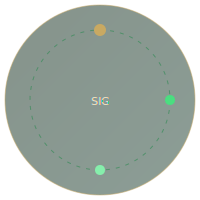
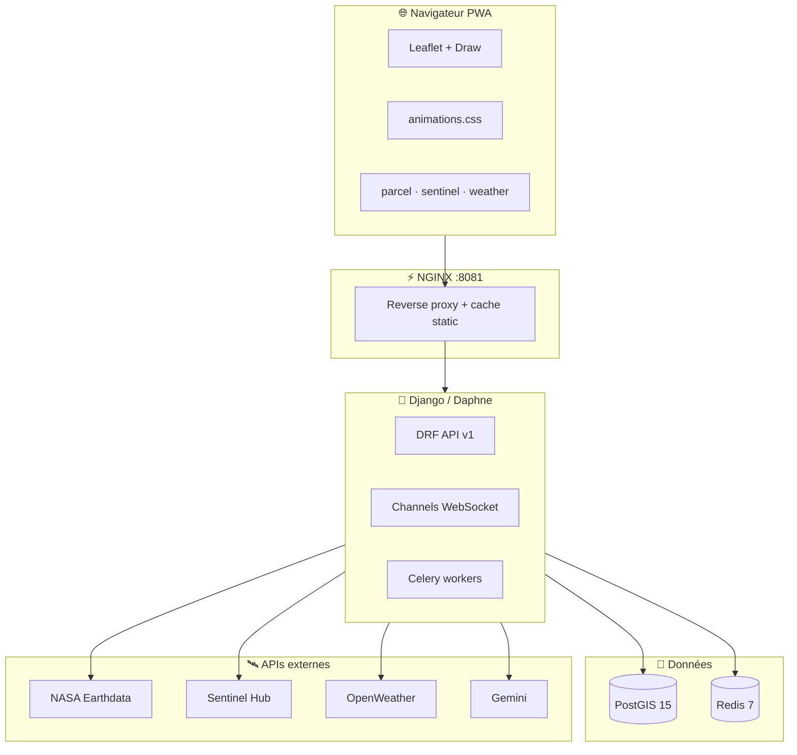

<div align="center">

<!-- ═══════════════════ HERO LUXE ANIMÉ ═══════════════════ -->


<br/>


<br/>


<br/>


<br/><br/>

### ✦ ✦ ✦ Système d'Information Géographique intelligent des sols ✦ ✦ ✦

<sub><i>Cartographie temps réel · NASA · Sentinel-2 · OpenWeather · IA · Éducation · Communauté</i></sub>

<br/>

**Maître d'ouvrage** — DISIA · Ministère de l'Agriculture (République Togolaise)  
**Maître d'œuvre** — **DUSOL**

<br/>

<!-- Texte défilant luxe 1 -->


<br/>

<!-- Texte défilant 2 — style néon vert -->


<br/>


<br/>

<table>
<tr>
<td align="center" width="33%">

<br/><b>165+</b><br/><sub>points sol</sub>
</td>
<td align="center" width="33%">
<br/><br/>
<b>15+</b> fiches · <b>100+</b> quiz
</td>
<td align="center" width="33%">
<br/><br/>
<b>20+</b> endpoints
</td>
</tr>
</table>

</div>

---

<!-- TOC -->
<details open>
<summary><b>📑 Table des matières</b></summary>

| | |
|---|---|
| [🚀 Démarrage](#-démarrage-express) | [✨ Fonctionnalités](#-fonctionnalités-phares) |
| [🎬 Expérience UI](#-expérience-interface--animations) | [🏗️ Architecture](#️-architecture) |
| [📦 Modules](#-modules-backend) | [🔌 API](#-api--exemples) |
| [🛰️ Config `.env`](#️-configuration-env) | [📚 Documentation](#-documentation) |
| [📋 Livrables TdR](#-livrables-tdr-v30) | |

</details>


---


## 🚀 Démarrage express

```bash
git clone <repo>
cd DUSOL_PROJET
cp .env.example .env
# Clés : OPENWEATHER_API_KEY · SENTINEL_HUB_* · NASA_EARTHDATA_* · GEMINI_API_KEY
docker compose up -d --build
```

| 🌐 Service | 🔗 URL |
|:----------:|:------|
| **Application** | http://localhost:8081 |
| **API REST** | http://localhost:8081/api/v1/ |
| **Admin** | http://localhost:8081/admin/ |
| **Health** | http://localhost:8081/health/ |
| **App mobile Flutter** | `mobile/` → même API `/api/v1/` |

### 📱 Application mobile (Flutter)

```bash
cd mobile && flutter pub get
flutter run -d linux                    # PC Linux
flutter run -d android                  # Émulateur Android
flutter run --dart-define=API_BASE_URL=http://192.168.x.x:8081/api/v1  # Téléphone réel
```

Modules : carte, dashboard, parcelle, quiz, fiches, vidéos, shorts, communauté, assistant IA — voir [`mobile/README.md`](mobile/README.md).

<details>
<summary><b>🔐 Comptes démonstration</b> — <code>make seed</code></summary>

| 👤 Utilisateur | 🔑 Mot de passe | 🎭 Rôle |
|:-------------|:----------------|:--------|
| `admin` | `admin123` | Administrateur |
| `agent1` | `agent123` | Agent terrain |
| `public1` | `public123` | Citoyen / public |

</details>

```bash
make seed                    # Jeu de données complet
make train-ml                # Modèle fertilité
make test                    # Pytest
./scripts/fix-docker-web.sh  # Réparer nginx ↔ OpenWeather 404
./scripts/reload-sentinel.sh # Recharger clés Sentinel Hub
```


---


## ✨ Fonctionnalités phares

<table>
<tr>
<td width="50%" valign="top" align="center">

### 🗺️ Carte & spatial


- Points sol colorés (pH, type, validation)
- **Parcelles** cantons & zones dégradées
- Heatmap, proximité, buffer, intersection
- **Analyse parcelle** : NASA + Sentinel + météo
- Dessin polygone · export JSON / GeoJSON
- Badge météo & NDVI sur la carte

</td>
<td width="50%" valign="top" align="center">

### 🛰️ Données satellite & météo


- **NASA Earthdata** MODIS · SMAP · STAC
- **Sentinel Hub** tuiles NDVI & true color
- **OpenWeather** actuel + prévisions parcelle
- Ingestion Celery · cache Redis
- Sonde NDVI au clic · couches opacité

</td>
</tr>
<tr>
<td valign="top" align="center">

### 🎓 Éducation & communauté


- Quiz multi-niveaux · mode examen
- Badges · classement · certificats **PDF**
- **15 fiches** pédagogiques (style article)
- Vidéos · shorts · stories · DM
- Hashtags · profils · modération

</td>
<td valign="top" align="center">

### 🤖 Intelligence artificielle


- Prédiction **fertilité** (RF / XGBoost)
- Score vulnérabilité & santé sol
- Recommandations agronomiques
- **Assistant chat** contextuel (Gemini)
- Modération vidéos assistée

</td>
</tr>
</table>


---


## 🎬 Expérience interface & animations

> Interface **luxe anime-inspired** — émeraude profond & or champagne, micro-interactions fluides.

| Fichier CSS/JS | Effet visuel |
|----------------|--------------|
| [`style.css`](frontend/css/style.css) | Typo **Cormorant** + **Outfit**, thème clair/sombre |
| [`animations.css`](frontend/css/animations.css) | `fadeUp` · `shimmer` · `navGlow` · `floatSoft` · stagger |
| [`enhancements.css`](frontend/css/enhancements.css) | Carte · parcelles · cartes Sentinel/météo |
| [`sentinelMap.js`](frontend/js/sentinelMap.js) | Couches tuiles · sonde NDVI |
| [`weatherMap.js`](frontend/js/weatherMap.js) | Popup météo · badge live · ☁ contrôle |

<details>
<summary><b>🎞️ Liste des animations clés (frontend)</b></summary>

| Animation | Où ? |
|-----------|------|
| Entrée des vues (`fadeUp` + stagger) | Navigation Carte / Dashboard / Quiz |
| Skeleton chargement parcelle | Panneau live |
| Pulsation bouton nav actif | `navGlow` |
| Toast slide-in | Notifications |
| Heatmap & clusters | Carte Leaflet |
| Badge météo / Sentinel | Coin carte |
| Cartes externes parcelle | Rapport + dashboard |
| Onboarding tour | Première visite |

</details>


---


## 🏗️ Architecture



```
┌──────────────────────────────────────────────────────────────────┐
│  🎨 Frontend · Leaflet · PWA · modules ES (carte, dashboard…)     │
└─────────────────────────────┬────────────────────────────────────┘
                              ▼
┌──────────────────────────────────────────────────────────────────┐
│  🔶 NGINX  ──►  Django 4  +  DRF  +  Daphne  +  Channels          │
│                 Celery Beat  +  Celery Worker                      │
└───────┬──────────────────────────────┬───────────────────────────┘
        ▼                              ▼
   🐘 PostGIS                      ⚡ Redis
```


---


## 📦 Modules backend

| 📁 App | 🎯 Rôle |
|:-------|:--------|
| `accounts` | JWT · rôles · profils · GPS live · social · DM |
| `soils` | Points sol · zones admin · dashboard KPI |
| `spatial` | Parcelles · proximité · buffer · vulnérabilité · NDVI |
| `nasa` | Catalogue STAC · ingestion MODIS/SMAP |
| `sentinel` | OAuth · tuiles · analyse NDVI bbox |
| `weather` | OpenWeather actuel & prévisions |
| `ml_predict` | Fertilité ML · métriques · Celery train |
| `education` | Quiz · fiches PDF · parcours · défis |
| `videos` | Upload · likes · modération admin |
| `assistant` | Chat Gemini · contexte parcelle/NASA |
| `sig_platform` | Alertes · exports ministère · analytics |


---


## 🔌 API — exemples

📖 [`docs/API.md`](docs/API.md) · 📮 [`Postman`](docs/postman/SIG-SOLS.postman_collection.json) · 🌍 [`API externes`](docs/API_EXTERNES.md)

```bash
# ─── Auth ───
curl -s -X POST http://localhost:8081/api/v1/auth/token/ \
  -H "Content-Type: application/json" \
  -d '{"username":"agent1","password":"agent123"}'

# ─── OpenWeather ───
curl -s http://localhost:8081/api/v1/weather/status/
curl -s "http://localhost:8081/api/v1/weather/current/?lat=6.4&lon=1.35"

# ─── Sentinel Hub ───
curl -s http://localhost:8081/api/v1/sentinel/status/
curl -s http://localhost:8081/api/v1/sentinel/layers/

# ─── Parcelle (Sentinel + météo) ───
curl -s -X POST http://localhost:8081/api/v1/spatial/parcel/live/ \
  -H "Content-Type: application/json" \
  -d '{"zone_code":"CANTON-M01","use_sentinel":true,"use_weather":true,"use_ml":false}'

# ─── IA fertilité ───
curl -s -X POST http://localhost:8081/api/v1/ml/predict/ \
  -H "Content-Type: application/json" \
  -d '{"ph":6.2,"humidity_pct":35,"soil_type":"limoneux"}'
```

<details>
<summary><b>📡 Endpoints météo & Sentinel (liste)</b></summary>

| Méthode | Route |
|---------|-------|
| GET | `/api/v1/weather/status/` |
| GET | `/api/v1/weather/current/?lat=&lon=` |
| GET | `/api/v1/weather/forecast/?lat=&lon=` |
| GET | `/api/v1/sentinel/status/` |
| GET | `/api/v1/sentinel/layers/` |
| POST | `/api/v1/sentinel/analyze/` |
| GET | `/api/v1/sentinel/tiles/{layer}/{z}/{x}/{y}.png` |
| POST | `/api/v1/spatial/parcel/live/` |
| POST | `/api/v1/spatial/parcel/analyze/` |

</details>


---


## 🛰️ Configuration `.env`

```bash
# ── OpenWeather ── https://openweathermap.org/api
OPENWEATHER_API_KEY=
OPENWEATHER_CACHE_SECONDS=600

# ── Sentinel Hub ── https://apps.sentinel-hub.com/
SENTINEL_HUB_CLIENT_ID=
SENTINEL_HUB_CLIENT_SECRET=

# ── NASA Earthdata ──
NASA_EARTHDATA_TOKEN=

# ── Assistant IA ──
GEMINI_API_KEY=
GEMINI_MODEL=gemini-2.5-flash-lite
```

➡️ Modèle complet : [`.env.example`](.env.example)


---

## 📚 Documentation

| 📄 Document | 📌 Contenu |
|:-----------|:---------|
| [Guide utilisateur](docs/GUIDE_UTILISATEUR.md) | Prise en main complète |
| [Utilisateur (court)](docs/UTILISATEUR.md) | Aide rapide |
| [API externes](docs/API_EXTERNES.md) | NASA · Sentinel · OpenWeather · OSM |
| [NASA setup](docs/NASA_SETUP.md) | Ingestion Earthdata |
| [L1 Spécifications](docs/L1_SPECIFICATIONS.md) | Cahier des charges |
| [L2 Modèle données](docs/L2_MODELE_DONNEES.md) | Schéma PostGIS |


---

## 📋 Livrables TdR v3.0

| Code | Livrable | 📎 |
|:----:|:---------|:---|
| **L1** | Spécifications | `docs/L1_SPECIFICATIONS.md` |
| **L2** | Modèle de données | `docs/L2_MODELE_DONNEES.md` |
| **L3** | API REST | OpenAPI + Postman |
| **L4** | Jeu de test | `seed_demo_data` |
| **L5** | Module IA | `apps/ml_predict/` |
| **L6** | Code source | Ce dépôt |
| **L7** | Guide utilisateur | `docs/GUIDE_UTILISATEUR.md` |
| **L8** | Déploiement | Docker + nginx |

---

<div align="center">


<br/>


<br/>


<br/>

<sub><b>MIT License</b> · Données terrain © DISIA · Données NASA domaine public · Crédits requis</sub>

<br/>

**⭐ Si ce projet vous aide, laissez une étoile sur le dépôt ⭐**

</div>


